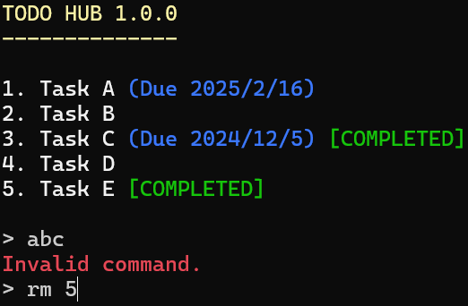

# Todo Hub

## About

**Todo Hub** is a command-based terminal to-do list manager.

## Features

- Add, remove, rename, and complete tasks
- Set due dates for tasks
- Colorful interface
- Saves your to-do list to a file

## Screenshot

## Installation

### Direct download

**Only Windows and Linux binaries are provided.**

1. Download `TodoHub-vX.X.X.zip` from the
    [latest release](https://github.com/willyblah/TodoHub/releases/latest).
2. Extract `TodoHub-vX.X.X.zip`.
3. Run `TodoHub.exe`.
    - The Windows binary is located in `build/windows-release`.
    - The Linux binary is located in `build/linux-release`.
4. It is recommended to create a shortcut to Todo Hub for easy access.

### Build from source

#### Requirements

- GCC (Windows/Linux) or Clang (macOS)
- CMake 3.10 or later

#### Steps

1. Download the source code from the [latest release](https://github.com/willyblah/TodoHub/releases/latest).
2. Extract the source code.
3. Run the build script for your system. Make sure you have permission to execute the script.
    - Windows: `build-windows.bat`
    - macOS: `build-macos.sh`
    - Linux: `build-linux.sh`
4. Run `TodoHub.exe`.
    - The Windows binary is located in `build/windows-release`.
    - The Linux binary is located in `build/linux-release`.
5. It is recommended to create a shortcut to Todo Hub for easy access.

## Support

Help content can be found in `docs/help.txt`. You can also access help by typing the
`help` command in Todo Hub.
